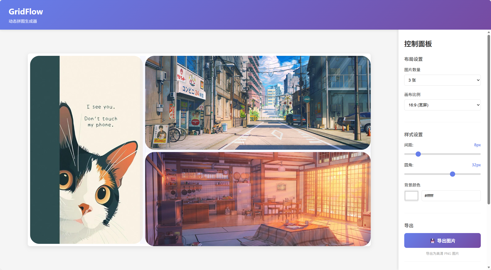

# GridFlow - 动态拼图生成器

基于网格布局的交互式图片拼接工具，支持实时调整布局和导出高清拼图。

## 使用示例

主界面演示


导出


## ✨ 核心功能

### 1. 多种上传方式
- 📷 **拖放上传** - 直接拖放图片文件到网格区域
- 🖱️ **点击选择** - 点击区域打开文件浏览器
- ⌨️ **剪贴板粘贴** - 使用 Ctrl+V 直接粘贴截图

### 2. 灵活的布局系统
- 支持 1-9 张图片的多种布局模式
- **可拖动边框** - 拖动分隔线实时调整每个区域的大小
- 智能初始布局（左一右二、2x2网格、2x3网格等）

### 3. 图片管理
- ✕ **删除功能** - 鼠标悬停时在图片右上角显示删除按钮
- 🎯 **智能裁剪** - 自动 Center Crop 填充容器

### 4. 样式自定义
- 调整图片间距（0-50px）
- 设置圆角大小（0-50px）
- 自定义背景颜色
- 多种画布比例（16:9、4:3、1:1、9:16、3:4）

### 5. 精细调整（Phase 2）
- 🎛️ 点击"进入精细调整"将网格布局转化为自由画布
- **移动** - 拖动任意元素自由定位，可相互重叠
- **缩放** - 拖动 8 个边角/边缘 handle 等比或拉伸缩放，旋转后仍保持正确的数学关系
- **旋转** - 拖动元素正上方的旋转手柄顺时针/逆时针旋转
- **图层管理** - 上移/下移/置顶/置底调整元素叠放顺序
- **属性面板** - 精确输入 X/Y/宽/高/旋转角度/圆角数值

### 6. 高清导出
- 💾 导出为 2400px 宽度的高清 PNG 图片
- 保持所有样式设置和布局比例
- Phase 2 精细调整后同样支持导出和复制到剪贴板

## 🚀 快速开始

### 安装依赖
```bash
npm install
```

### 启动开发服务器
```bash
npm run dev
```

访问 http://localhost:3000/

### 构建生产版本
```bash
npm run build
```

## 🎯 使用方法

**Phase 1 - 布局调整**

1. **选择图片数量** - 在右侧控制面板选择要拼接的图片数量
2. **添加图片** - 通过拖放、点击或粘贴方式添加图片
3. **调整布局** - 拖动图片之间的分隔线调整区域大小
4. **自定义样式** - 调整间距、圆角、背景色等参数
5. **删除图片** - 鼠标悬停在图片上，点击右上角的删除按钮
6. **导出拼图** - 点击"导出图片"按钮下载最终作品

**Phase 2 - 精细调整**

7. **进入精细调整** - 点击控制面板的"进入精细调整"按钮，网格布局将转化为自由画布
8. **移动元素** - 拖动图片元素到任意位置（支持超出画布边界）
9. **缩放元素** - 拖动 8 个 handle 调整大小，旋转后仍保持正确方向
10. **旋转元素** - 拖动元素上方的蓝色圆形旋转手柄
11. **调整图层** - 在属性面板点击图层按钮调整元素的叠放顺序
12. **精确调整** - 在属性面板直接输入数值精确控制位置、尺寸、旋转角度、圆角
13. **导出结果** - 在精细调整面板点击导出或复制，输出 2400px 宽高清 PNG

## 🛠 技术栈

- **React 18** - UI 框架
- **Vite 5** - 构建工具
- **Canvas API** - 图片渲染和导出
- **原生 CSS** - 样式设计

## 📝 项目结构

```
GridFlow/
├── src/
│   ├── components/
│   │   ├── ImageCell.jsx           # 图片单元格组件（拖放/点击/粘贴）
│   │   ├── GridLayout.jsx          # Phase 1 网格布局组件
│   │   ├── Divider.jsx             # 可拖动分隔线组件
│   │   ├── ControlPanel.jsx        # 控制面板（Phase 1 & 2 双模式）
│   │   ├── FinetuneCanvas.jsx      # Phase 2 自由画布容器
│   │   └── FinetuneElementItem.jsx # Phase 2 可移动/缩放/旋转元素
│   ├── utils/
│   │   └── exportCanvas.js         # 导出功能（Phase 1 & 2）
│   ├── App.jsx                     # 主应用组件（含阶段切换逻辑）
│   └── main.jsx                    # 应用入口
├── index.html
├── vite.config.js
└── package.json
```


---

## 📒 Changelog

<details>
<summary><strong>2026-02-23</strong> — 新增精细调整阶段（Phase 2）</summary>

#### 新增：精细调整阶段（Phase 2）

在 Phase 1 布局调整完成后，可点击"进入精细调整"进入 Phase 2。Phase 1 的网格布局将转化为自由画布，每张图片成为可独立操作的元素：

- 拖动移动、8 个 handle 缩放、旋转手柄旋转
- 属性面板精确输入坐标、尺寸、角度、圆角
- 图层顺序管理（上移/下移/置顶/置底）
- 导出和复制功能延续到 Phase 2，输出 2400px 高清 PNG

<details>
<summary>实现细节</summary>

- `App.jsx` 新增 `phase` / `elements` / `canvasDisplaySize` / `selectedId` state，`handleEnterFinetune` 通过 `getBoundingClientRect` 获取显示尺寸后调用 `calculateLayout` 初始化 elements 数组
- `FinetuneElementItem.jsx` 核心交互：旋转角度 = `atan2(dy, dx) + 90°`；resize 时通过局部坐标系变换矩阵（cosθ/sinθ）计算新 center 和尺寸，边缘 handle 投影到对应轴保证单轴约束
- `exportCanvas.js` 新增 `exportFinetuned` / `copyFinetuned`，将 display 坐标缩放到 2400px，用 `ctx.translate + rotate + clip + drawImage` 渲染每个元素

</details>

</details>

<details>
<summary><strong>2026-02-17</strong> — 复制到剪贴板 / 修复粘贴目标</summary>

#### 新增：复制图片到剪贴板

在控制面板导出区域新增「📋 复制图片」按钮，可将当前拼图直接复制到系统剪贴板，方便粘贴到微信、飞书、Figma 等应用中，无需先下载文件。

- 按钮带有状态反馈：复制中 → 已复制 / 复制失败，2 秒后自动重置
- 使用绿色渐变样式，与蓝紫色的导出按钮区分

<details>
<summary>实现细节</summary>

- 从 `exportToImage` 中提取公共的 `renderToCanvas()` 函数，复用 Canvas 渲染逻辑
- 新增 `copyToClipboard()` 导出函数，通过 `navigator.clipboard.write` + `ClipboardItem` 将 PNG 写入剪贴板
- 需要浏览器支持 Clipboard API（主流现代浏览器均已支持）

</details>

#### 修复：Ctrl+V 粘贴图片会填充所有网格

之前每个 `ImageCell` 都在 `document` 上注册了 `paste` 监听器，导致粘贴时所有网格同时接收图片。现已修复为仅将图片粘贴到鼠标悬停的网格中。

<details>
<summary>实现细节</summary>

- 在 `ImageCell` 中新增 `isHovered` 状态，通过 `onMouseEnter` / `onMouseLeave` 追踪鼠标位置
- `paste` 事件处理函数中增加 `if (!isHovered) return` 守卫，仅悬停的 cell 响应粘贴

</details>

</details>

## 📋 TODO

- [ ] **Phase 2 图片内部 pan/zoom** - 精细调整阶段支持调整图片在元素框内的显示位置（类似 object-position）
- [ ] **Phase 2 键盘快捷键** - Delete 删除选中元素，方向键微移，Esc 取消选中

## 📄 许可证

ISC
